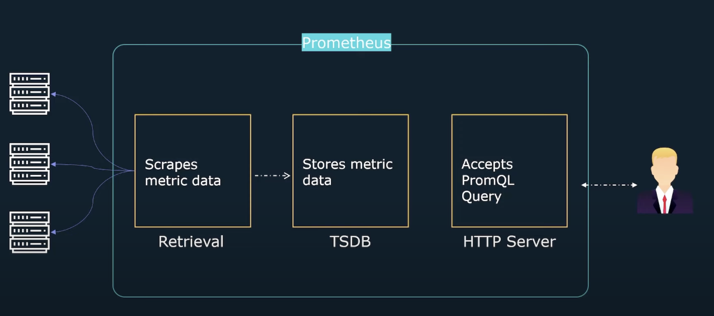

# Prometheus 

Prometheus is an open-source monitoring tool that collects metrices data, and provde tools to visialise the colected data. In addition, prometheus allows yo to generate alerts when metrices reach a user specified thesehold. Prometheus collects metrices by scrapping targets who expose metrices through an http endpoint. Remember that, prometheus then stores these scrapped metrices in time serire database which can be queried using Prometheus' built-in query language **PromQl**.

*So what kind of metrics prometheus can measure?* It can measure CPU/Memory Utilization, disk space, service uptime, application specific data, such as number of exceptions, latency, pending requests. It basically is responsible for measuring the **time-series** data that is numeric. *What kind of data prometheus can't measure?* It can measure the system logs and events. 

Lets say that again, prometheus is that tool which will store all that **metrics** inside some gaint database and will give you the liberty to see all those metrics in a centre of everything.  

# Understanding Events, Logs, and Metrics

In the world of HTTP/HTTPS and application monitoring, events, logs, and metrics provide different but complementary insights into the behavior and health of your systems.  Understanding their distinctions is crucial for effective observability.

**Events:**

Events represent discrete, noteworthy occurrences in your system. They signify a change in state or an action that has taken place. Events are typically immutable records of something that happened at a specific point in time.  Examples in an HTTP/HTTPS context might include:

* A server starting up or shutting down.
* A deployment of a new application version.
* A user logging in or out.
* A request exceeding a specific latency threshold.
* An error occurring during request processing.

Events are characterized by their descriptive nature. They tell you *what* happened, *when* it happened, and often *where* it happened. They provide context and are essential for understanding the timeline of activities and changes within your system.  They are less suitable for understanding trends, rates, and overall performance characteristics. For example, if requests are constantly taking too long, individual latency events are less helpful than the overall average request duration.

**Logs:**

Logs are detailed, timestamped records of events and other information generated by your application and infrastructure. They provide a granular audit trail of system activity.  In HTTP/HTTPS, logs can include:

* Web server access logs (recording each request, its source, status code, etc.)
* Application logs (capturing internal application events, errors, debug information).
* Security logs (recording authentication attempts, authorization decisions, etc.).

Logs offer a rich source of information for debugging, troubleshooting, and security analysis.  They are the go-to resource when you need to understand the sequence of operations leading to an issue or to identify the root cause of an error. They allow you to drill down into specifics to track bugs and their potential solutions. Logs can provide context for understanding why an event occurred, whereas the event itself indicates that something happened.

**Metrics:**

Metrics are numerical measurements that track the performance and behavior of your system over time. They provide quantifiable data about various aspects of your application and infrastructure.  In HTTP/HTTPS and web applications, common metrics include:

* Request rate (number of requests per second).
* Error rate (percentage of requests resulting in errors).
* Request latency (time taken to process a request).
* CPU usage.
* Memory usage.

Metrics are essential for understanding trends, identifying anomalies, and monitoring overall system health.  They are typically aggregated and analyzed over time to provide insights into performance patterns and potential bottlenecks.  Metrics are excellent for alerting—for example, if your error rate suddenly spikes, you can trigger an alert to investigate.